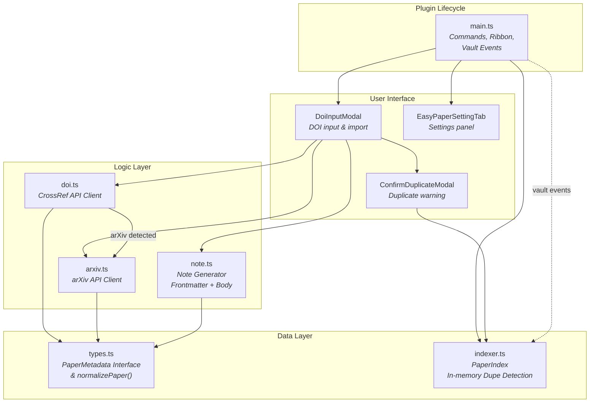
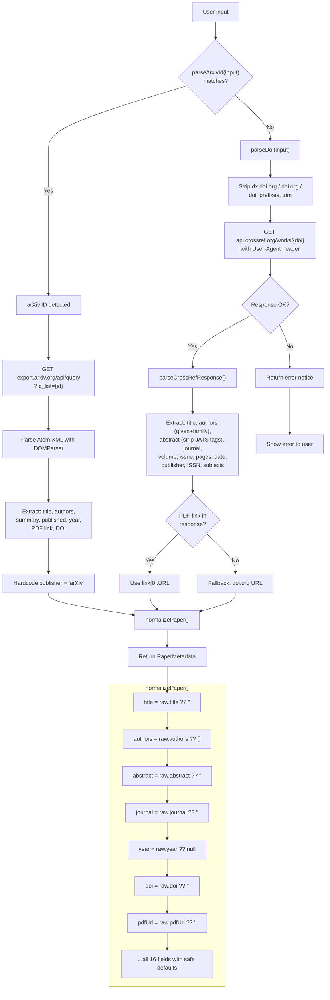
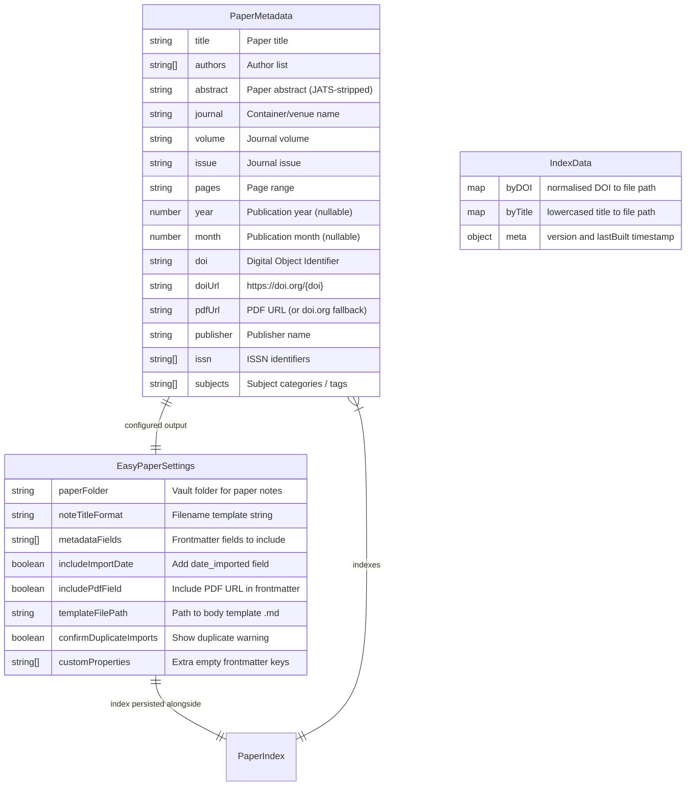

# Easy Paper Importer for Obsidian 📚

[](https://obsidian.md)
[](https://github.com/Loic-Lemon/obsidian-easy-paper-importer/blob/master/LICENSE)
[](https://github.com/Loic-Lemon/obsidian-easy-paper-importer/releases)
[](https://www.typescriptlang.org/)

> **Import academic paper metadata from a DOI into Obsidian** — auto-fetches from CrossRef and arXiv, generates rich YAML frontmatter, and creates organized paper notes.

---

## 📋 Table of Contents

- [How it works](#-how-it-works)
- [Features](#-features)
- [Quick start](#-quick-start)
- [Import flow](#-import-flow)
- [Algorithm](#-metadata-fetching-algorithm)
- [Data model](#-data-model)
- [Frontmatter fields](#-frontmatter-fields)
- [Template tokens](#-template-tokens)
- [Commands](#-commands)
- [Settings](#-settings)
- [Development](#-development)
- [License](#-license)

---

## 🔧 How it works

The plugin is built around four cooperating layers:



- **Data layer** defines the `PaperMetadata` schema and maintains an in-memory index of imported papers for duplicate detection.
- **Logic layer** fetches metadata from CrossRef or arXiv, normalises it, and generates Markdown notes with YAML frontmatter.
- **UI layer** presents modals for DOI input, duplicate confirmation, and a full settings tab.
- **Plugin lifecycle** wires everything: commands, ribbon icon, vault file event listeners for index sync.

---

## ⚡ Features

| Icon | Feature | Detail |
|------|---------|--------|
| 🎯 | **DOI / arXiv input** | Paste any DOI, DOI URL, arXiv ID, or arXiv URL — auto-detects source |
| 📡 | **CrossRef integration** | Fetches title, authors, abstract, journal, volume, issue, pages, publisher, ISSN, subjects, PDF link |
| 🌌 | **arXiv integration** | Auto-detects arXiv IDs (modern, legacy, DOI-embedded) and fetches from arXiv Atom API |
| 📝 | **Custom filename templates** | Use `{{title}}`, `{{year}}`, `{{doi}}`, `{{authors}}`, `{{first_authors}}` — auto-sanitised |
| 🏷️ | **Configurable YAML frontmatter** | Pick which fields to include; optional `date_imported` and custom empty properties |
| 📄 | **Body templates** | Optional `.md` template file with `{{abstract}}`, `{{authors}}`, `{{subjects}}` and more |
| 🔍 | **Duplicate detection** | In-memory index checks by DOI and title; optional confirmation modal |
| 🔄 | **Auto-index sync** | Vault create/delete/rename events keep the index up to date |
| ⚙️ | **Full settings tab** | Folder picker, template picker, field selection, toggle switches |

---

## 🚀 Quick start

1. **Install** the plugin (see [Development](#-development) below)
2. **Open** Settings → Easy Paper Importer and set your **paper folder** (default: `Papers/`)
3. **Run** *Import paper from DOI* from the ribbon icon () or command palette
4. **Paste** a DOI (e.g., `10.1038/nature12373`) and press Enter — the note is created and opened automatically

---

## 🔄 Import flow

```mermaid
sequenceDiagram
    participant U as You
    participant Modal as DoiInputModal
    participant Fetch as fetchPaperMetadata
    participant CrossRef as CrossRef API
    participant ArXiv as arXiv API
    participant Index as PaperIndex
    participant Dup as ConfirmDuplicateModal
    participant Note as createPaperNote
    participant Vault as Obsidian Vault

    U->>Modal: Click ribbon / command
    Modal->>Modal: Show DOI input field
    U->>Modal: Paste DOI & press Enter
    Modal->>Fetch: fetchPaperMetadata(doi)

    alt arXiv ID detected
        Fetch->>ArXiv: GET export.arxiv.org/api/query?id_list={id}
        ArXiv-->>Fetch: Atom XML → PaperMetadata
    else CrossRef DOI
        Fetch->>CrossRef: GET api.crossref.org/works/{doi}
        CrossRef-->>Fetch: JSON → PaperMetadata
    end

    Fetch-->>Modal: PaperMetadata (normalised)
    Modal->>Index: findDuplicate({doi, title})

    alt Duplicate found & confirm enabled
        Index-->>Modal: { type, path }
        Modal->>Dup: openAndWait()
        alt User cancels
            Dup-->>Modal: false
            Modal->>Modal: Abort import
        else User continues
            Dup-->>Modal: true
        end
    end

    Modal->>Note: createPaperNote(app, paper, settings)
    Note->>Vault: ensureFolder(paperFolder)
    Note->>Note: renderFilenameTemplate()
    Note->>Note: sanitiseFilename() + dedup suffix
    Note->>Note: buildFrontmatter() + buildBody()
    Note->>Vault: vault.create(filePath, content)
    Note-->>Modal: filePath
    Modal->>U: Open new note & show "Imported: {title}"
```

### What happens step by step

| Step | Component | Action |
|------|-----------|--------|
| 1 | `DoiInputModal` | User enters DOI, clicks Import or presses Enter |
| 2 | `fetchPaperMetadata()` | Checks if input looks like arXiv; delegates accordingly |
| 3 | `parseDoi()` / `parseArxivId()` | Strips URL prefixes, extracts clean identifier |
| 4 | CrossRef / arXiv API | GET request with metadata response |
| 5 | `parseCrossRefResponse()` / XML parser | Extracts all fields from JSON or Atom XML |
| 6 | `normalizePaper()` | Fills missing fields with safe defaults |
| 7 | `PaperIndex.findDuplicate()` | Checks byDOI (normalised), then byTitle (lowercased) |
| 8 | `ConfirmDuplicateModal` (optional) | Asks user to confirm or cancel duplicate import |
| 9 | `createPaperNote()` | Generates filename, frontmatter, body; writes to vault |
| 10 | Obsidian API | Opens the newly created note |

---

## 🧮 Metadata fetching algorithm



### Supported arXiv ID formats

| Format | Example | Regex source |
|--------|---------|-------------|
| Modern arXiv ID | `2101.01234` | `\d{4}\.\d{4,5}` |
| Legacy arXiv ID | `cs/0101010` | `[a-z\-]+(\.[A-Z]{2})?/\d{7}` |
| arXiv URL (abs) | `https://arxiv.org/abs/2101.01234` | URL prefix + ID |
| arXiv URL (pdf) | `https://arxiv.org/pdf/2101.01234.pdf` | URL prefix + ID |
| DOI-embedded arXiv | `10.48550/arXiv.2101.01234` | `10.48550/arXiv.` prefix |

### CrossRef date fallback chain

The plugin attempts to extract the publication date in this order:

1. `published-print.date-parts` (preferred)
2. `published-online.date-parts` (fallback)
3. `issued.date-parts` (last resort)

Each date-parts array is `[year, month?, day?]`. If all are missing, `year` defaults to `null`.

---

## 💾 Data model



### Persistence (`data.json`)

The plugin stores settings and the paper index in a single `data.json` file:

```json
{
  "paperFolder": "Papers",
  "noteTitleFormat": "{{first_authors}}_{{year}}",
  "metadataFields": ["title", "authors", "year", "doi"],
  "includeImportDate": true,
  "includePdfField": true,
  "templateFilePath": "",
  "confirmDuplicateImports": true,
  "customProperties": [],
  "index": {
    "byDOI": {
      "10.1038/nature12373": "Papers/Smith_2013.md"
    },
    "byTitle": {
      "the structure of dna": "Papers/Smith_2013.md"
    },
    "meta": {
      "version": 1,
      "lastBuilt": "2026-07-02T12:00:00.000Z"
    }
  }
}
```

The index is stripped from settings on load (`loadSettings()`) and re-merged on save (`persist()`) to prevent conflicts.

---

## 📋 Frontmatter fields

These fields are rendered in order based on the `metadataFields` setting (comma-separated list in settings).

| Setting key | `PaperMetadata` source | YAML output | Notes |
|-------------|----------------------|-------------|-------|
| `title` | `paper.title` | `title: "The title"` | Double-quoted, escaped |
| `authors` | `paper.authors` | `authors:\n  - "Given Family"` | YAML list |
| `journal` | `paper.journal` | `journal: "Nature"` | |
| `year` | `paper.year` | `year: 2021` | Number (no quotes) |
| `volume` | `paper.volume` | `volume: "42"` | |
| `issue` | `paper.issue` | `issue: "1"` | |
| `pages` | `paper.pages` | `pages: "123-456"` | |
| `publisher` | `paper.publisher` | `publisher: "Springer"` | |
| `doi` | `paper.doi` | `doi: "10.1038/..."` | |
| `url` | `paper.doiUrl` | `url: "https://doi.org/..."` | |
| `pdf` | `paper.pdfUrl` | `pdf: "https://..."` | Only if `includePdfField` is true |
| `issn` | `paper.issn` | `issn:\n  - "1234-5678"` | YAML list |
| `tags` | `paper.subjects` | `tags:\n  - subject-name` | Lowercased, hyphenated |

Additionally, if `includeImportDate` is `true`, a `date_imported` field is appended with the current ISO date (`2026-07-02`). Any keys in `customProperties` are appended as empty fields.

---

## 📝 Template tokens

### Filename template (`noteTitleFormat`)

| Token | Renders as | Example output |
|-------|-----------|---------------|
| `{{title}}` | Sanitised title (safe chars only) | `The structure of DNA` |
| `{{year}}` | Publication year | `2021` |
| `{{doi}}` | DOI with safe characters | `10.1038_nature12373` |
| `{{authors}}` | Surname list: ≤3 = "Surn1, Surn2, Surn3", >3 = "Surn1 et al." | `Watson et al.` |
| `{{first_authors}}` / `{{first_author}}` | Single first-author surname | `Watson` |

The filename is sanitised via `sanitiseFilename()`:
- Removes `\ / : * ? " < > |`
- Collapses whitespace, strips trailing dots
- Truncated at 200 characters
- Collisions auto-suffixed with ` (1)`, ` (2)`, etc.

### Body template (`templateFilePath`)

| Token | Renders as |
|-------|-----------|
| `{{title}}` | Full paper title |
| `{{year}}` | Publication year |
| `{{doi}}` | DOI string |
| `{{doiUrl}}` / `{{doi_url}}` | `https://doi.org/{doi}` |
| `{{pdf}}` / `{{pdfUrl}}` / `{{pdf_url}}` | PDF URL |
| `{{journal}}` | Journal/container name |
| `{{volume}}` | Volume |
| `{{issue}}` | Issue |
| `{{pages}}` | Page range |
| `{{publisher}}` | Publisher name |
| `{{abstract}}` | Full abstract text |
| `{{authors}}` | Comma-separated full names (given + family) |
| `{{first_authors}}` / `{{first_author}}` | Surname + " et al." |
| `{{subjects}}` | Comma-separated subject list |

Token matching is case-insensitive (e.g., `{{DOI}}` and `{{doi}}` both work).

---

## ⌨️ Commands

| ID | Name | Trigger | Action |
|----|------|---------|--------|
| `import-paper-from-doi` | Import paper from DOI | Ribbon icon () + Command palette | Opens `DoiInputModal` — enter DOI, fetches metadata, creates note |
| `rebuild-paper-index` | Rebuild paper index | Command palette | Re-scans paper folder, rebuilds DOI/title index from frontmatter |

---

## ⚙️ Settings

| Setting | Type | Default | Description |
|---------|------|---------|-------------|
| Paper folder | `string` | `"Papers"` | Vault folder where paper notes are created |
| Note title format | `string` | `"{{first_authors}}_{{year}}"` | Template for generated filenames |
| Metadata fields | `string[]` | `["title", "authors", "year", "doi"]` | Comma-separated frontmatter fields to include |
| Include import date | `boolean` | `true` | Append `date_imported` to frontmatter |
| Include PDF field | `boolean` | `true` | Include `pdf` URL in frontmatter |
| Template file path | `string` | `""` | Path to `.md` body template (optional) |
| Confirm duplicate imports | `boolean` | `true` | Show confirmation dialog when duplicate detected |
| Custom properties | `string[]` | `[]` | Extra empty frontmatter keys (comma-separated) |

---

## 🛠️ Development

### Prerequisites

- [Node.js](https://nodejs.org/) 18+
- npm

### Install

```bash
npm install
```

### Dev (watch mode)

```bash
npm run dev
```

### Production build

```bash
npm run build
```

Runs TypeScript check (`tsc -noEmit -skipLibCheck`) then bundles with esbuild (CJS, ES2018 target).

### Lint

```bash
npm run lint
```

Uses ESLint with `typescript-eslint` and `eslint-plugin-obsidianmd`.

### Project structure

```
src/
├── main.ts               # Plugin lifecycle, commands, ribbon, vault events
├── types.ts              # PaperMetadata interface + normalizePaper()
├── settings.ts           # EasyPaperSettings + defaults + setting tab UI
├── doi.ts                # CrossRef API client + DOI parsing
├── arxiv.ts              # arXiv API client + arXiv ID parsing
├── indexer.ts            # PaperIndex — in-memory duplicate detection
├── note.ts               # Note generation (frontmatter + body templates)
└── ui/
    ├── doi-modal.ts      # Main DOI input modal
    └── confirm-duplicate-modal.ts  # Duplicate confirmation dialog
```

### Build system

| Detail | Value |
|--------|-------|
| Bundler | esbuild (CJS format) |
| Target | ES2018 |
| Entry | `src/main.ts` → `main.js` |
| Runtime | Obsidian `0.15.0+` (desktop only) |

### Installation (in vault)

1. Build the plugin (`npm run build`)
2. Copy `main.js`, `manifest.json`, and `styles.css` to `<Vault>/.obsidian/plugins/easy-paper-importer/`
3. Enable the plugin in Obsidian Settings → Community plugins

---

## 📄 License

0BSD — See [LICENSE](./LICENSE) for details.
